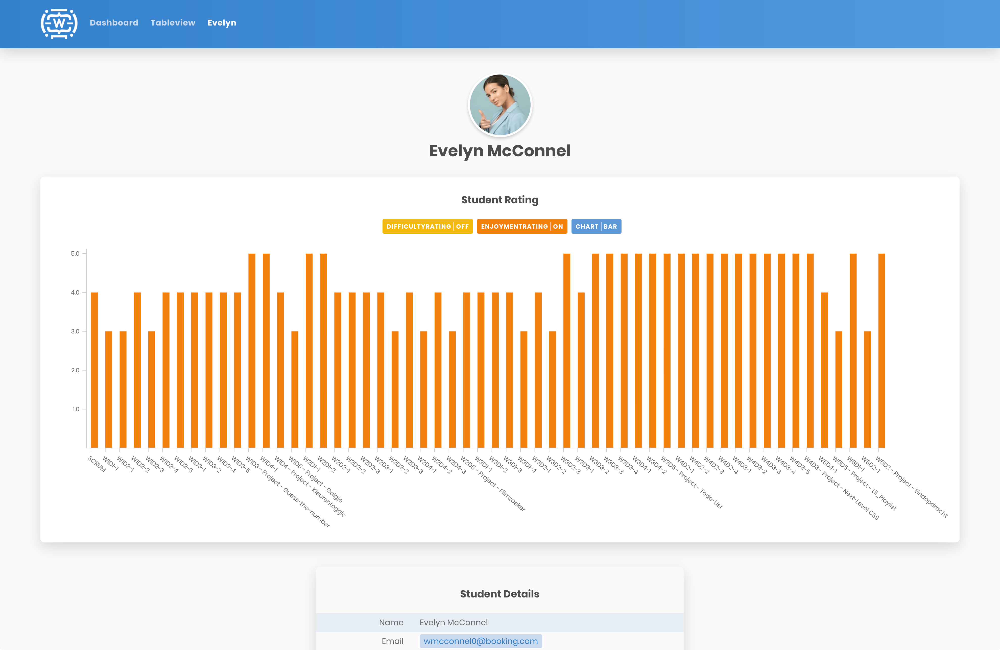
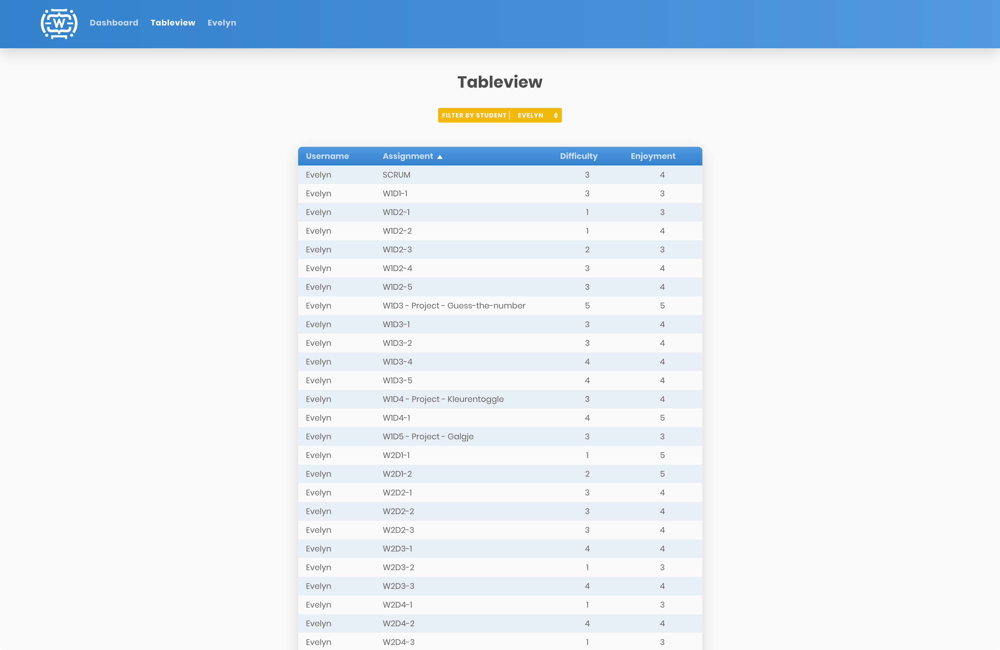

# Winc Academy Project: Winc Student Dashboard

Final project week 6

## Previews

You can view a live version of the Student Dashboard here: https://wsd-react.leon.ist/

1. Dashboard View: Charts

2. Dashboard View: Students

3. Dashboard View: Filter By Student (one or more)

4. Student View

5. Table View

## Project Choices and Description (Dutch):

# Projectkeuzes en beschrijving

## Uitgangspunt

Vanuit de basisgedachte dat het project een begin is van een veel uitgebreider dashboard dat daadwerkelijk gebruikt gaat worden, ben ik eerst gaan onderzoeken wat de juiste opbouw van componenten voor de programmering en weergave zou kunnen zijn.

Qua vormgeving en stijl heb ik gekeken naar de website van Winc Academy. Zo heb ik de keuze gemaakt om gebruik te maken van de kleuren lichtblauw, okergeel en licht- en donkergrijs, tegen een witte achtergrond en het lettertype Poppins van Google Fonts. Op basis van een schets van een webpagina in Sketch ben ik gestart met programmeren.

Voor dit project heb ik geen gebruik gemaakt van Bootstrap of een ander framework, of symbolen van Font Awesome. De gebruikte symbolen voor selectiemenu en sorteren van kolommen zijn SVG's, voor maximale scherpte op ieder scherm.

Uit de data die door Winc headquarters is aangeleverd kon ik tien studenten herleiden en 56 opdrachten, waarvan een aantal projecten. Via Mockaroo heb ik wat testdata toegevoegd, zoals een avatar, achternaam, adresgegevens en een e-mailadres. De avatars veroorzaakten echter een grote vertraging bij het laden in de browser. Daarom ben ik op zoek gegaan naar foto’s van echte mensen, in dit geval via Pexels.

## Dashboard component

Bij de dashboard weergave heb ik ervoor gekozen om alle 56 opdrachten en projecten in één grafiek weer te geven en de volle breedte van het browservenster te gebruiken. Omdat de labels bij deze grafiek door elkaar heen lopen, staan ze onder een hoek van 40 graden. Zo zijn ze nog steeds te lezen en heb je in één overzicht een beeld van alle ratings.

De oranje, okergele en blauwe knop werken als legenda, status en interactie in één. Daardoor blijft de weergave schoon en overzichtelijk. In eerste instantie waren beide grafieken zichtbaar, maar omdat dit een erg onrustig beeld gaf, heb ik ervoor gekozen om een knop toe te voegen en het wisselen tussen bar en line mogelijk te maken.

Onder de grafiek vind je de tien studenten uit deze groep. In een verder ontwikkeld dashboard zou ik willen kunnen filteren op studiejaar, de verschillende groepen studenten per opleiding, of de verschillende type opleidingen zoals frontend, backend en full-stack, in voltijd, deeltijd of studeren op eigen tempo.

De uitdaging in dit gedeelte was om de studenten goed in beeld te brengen. Door de avatars te tonen wordt het dashboard een stuk persoonlijker. Voor iedere student is er een checkbox om de grafieken te kunnen filteren op één of meer studenten. Verder is er een link naar de ruwe tabel gegevens en een link naar de pagina van de student. De checkbox werkt net zoals de buttons boven de grafiek, dus zowel status als interactie. Bij het selecteren van studenten zie je direct boven de grafiek welke studenten in het filter worden meegenomen.

De grafieken op het dashboard kunnen nog uitgebreid worden met een selectiemenu voor opdrachten en projecten, zodat de weergave veranderd in ratings voor de studenten tegen één opdracht in plaats van alle opdrachten. Daar ben ik niet meer aan toegekomen, omdat ik tijd wilde besteden aan opmerkingen bij componenten, functies en variabelen, alsmede het zoveel mogelijk leesbaar maken van de code. Ook het sorteren van de grafiek op opdracht naam en beide ratings, oplopend of aflopend, heb ik voor nu gelaten.

## Student component

De pagina voor een student toont dezelfde grafieken als het dashboard, maar dan voor één student. Onder de grafiek vind je de gekoppelde test data. Ook hier is er een link naar de tabel weergave.  Als het dashboard verder wordt ontwikkeld, zou ik meer gegevens willen tonen die voor de student beschikbaar zijn. Een link of koppeling met het studenten profiel op de Winc website bijvoorbeeld.

## Tabel component

De ruwe data voor het dashboard heb ik ongewijzigd gelaten en wordt in deze pagina in tabelvorm weergegeven. Het sorteren werkt op iedere kolom, waarbij de sortering wordt teruggezet naar oplopend als je een andere kolom selecteert. Sorteren kan oplopend of aflopend.

Omdat het tonen van de gegevens van alle studenten de tabel weergave onoverzichtelijk zou maken, ben ik gestart met een selectiemenu om de tabel te kunnen filteren op één student. Via verschillende links naar deze pagina wordt het filter op voorhand al ingesteld via de state. Het dashboard zou ik verder ontwikkelen door een filter toe te voegen voor een specifieke opdracht, zodat de tabel de gegevens kan weergeven voor alle studenten. Ook zou ik de gegevens in de tabel actief maken, zodat het klikken op de naam van een opdracht het filter voor opdrachten activeert.  Of klikken op een rating een filter voor alle ratings met dezelfde waarde activeert. Een andere weergave zou een tweedimensionale tabel kunnen zijn zoals in een spreadsheet, met studenten in kolommen en opdrachten in rijen.

## Routing en config

Voor de routing ben ik uitgegaan van `/dashboard/students`, omdat een dashboard ook verder ontwikkeld kan worden met andere entiteiten, zoals studiejaar or type opleiding. Die kunnen dan makkelijk toegevoegd worden als subdirectories van `/dashboard`. Bepaalde constanten, zoals die voor de routing en navigatie, heb ik aan een globale config toegevoegd, zodat ze op een centrale plek zichtbaar zijn en makkelijk kunnen worden aangepast zonder door de code te zoeken.
